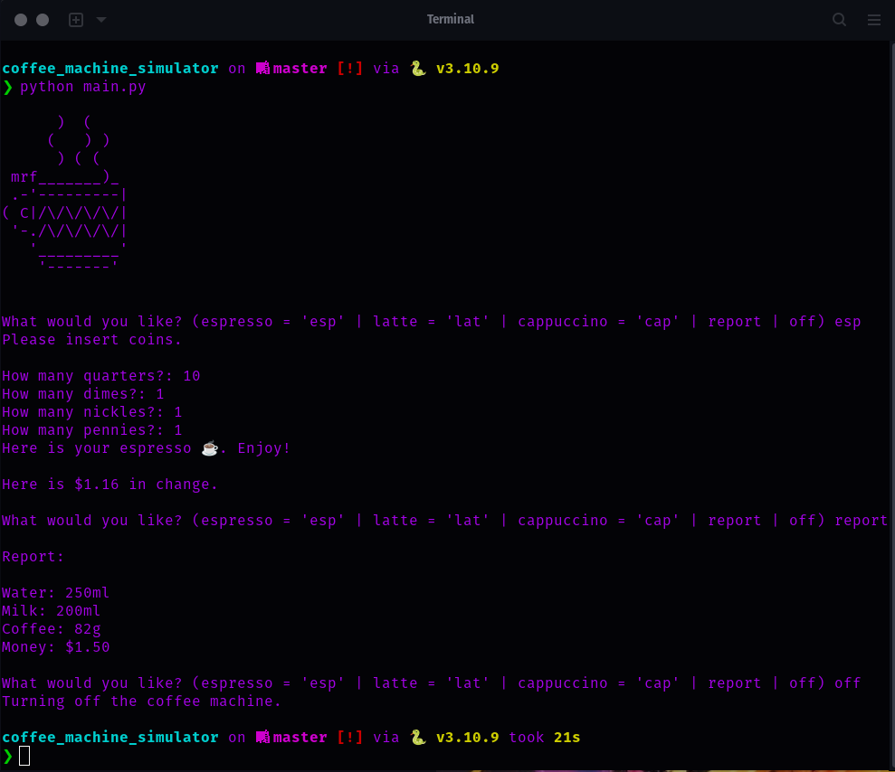

# Coffee Machine Simulator

This is a simple command-line Python program that simulates a coffee machine. The coffee machine offers three different types of coffee: espresso, latte, and cappuccino. Users can interact with the coffee machine to select a drink, insert coins, and receive their beverage. The program also includes a report feature to display the machine's current resources and earnings.
## Features

- Select from three different coffee types:
  - Espresso
  - Latte
  - Cappuccino
- Insert coins (quarters, dimes, nickels, and pennies) for payment.
- Receive change if overpayment occurs.
- Print a report of the coffee machine's resources and earnings.

## Dependencies

This program uses Pipenv for dependency management. Ensure you have both Python 3.x and Pipenv installed on your machine.

## How to Run

1. Clone this repository or download the files.
```git clone https://github.com/j-breedlove/coffee_machine_simulator.git```
2. Navigate to the project directory in your terminal or command prompt.
```cd coffee_machine_simulator```
3. Install dependencies using `pipenv install`.
4. Activate the Pipenv shell with `pipenv shell`.
5. Run the command `python main.py` to start the program.

## Usage

Upon launching, the program will prompt you for your drink choice:

